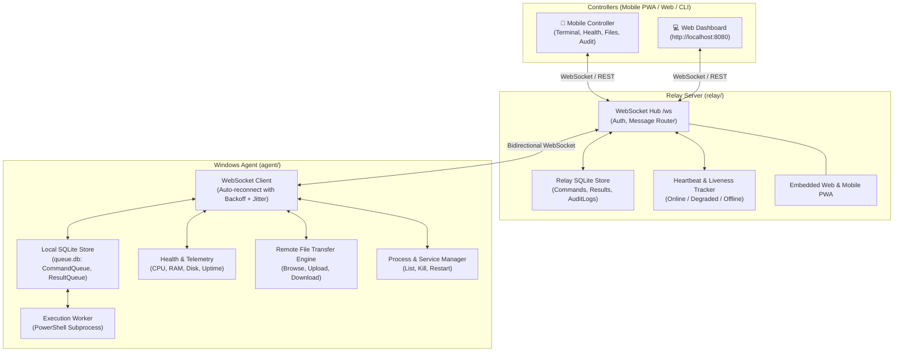

# terminal-app

A resilient remote-terminal / device-management system: mobile & web controllers talk to a
Windows background agent through a central relay, with offline queuing so commands and results
survive network drops, sleep, and reboots.

> **Status:** All Phases (1, 2, 3 & 4) complete — Central Relay Server with Mobile PWA, Remote File Transfer, Process Manager, Telemetry & Security Audit Logs are live.

---

## System Architecture



---

## Roadmap

- [x] **Phase 1 — Core agent & terminal:** Windows background service executes PowerShell, captures output, persists to a local SQLite queue with crash recovery and retries. See [`agent/`](agent/).
- [x] **Phase 2 — Relay & WebSocket layer:** Central Go relay server, typed WebSocket message envelopes (`AUTH`, `HEARTBEAT`, `DISPATCH_CMD`, `CMD_RESULT`), device registry, and single-page Web Dashboard. See [`relay/`](relay/).
- [x] **Phase 3 — Resilience layer:** Cloud offline command queuing, automatic FIFO flushing on agent reconnect, offline result syncing (`Synced = 0 -> 1`), heartbeat liveness state machine (`ONLINE` -> `DEGRADED` -> `OFFLINE`), and exponential backoff with jitter.
- [x] **Phase 4 — Mobile interface & polish:** Touch-first Mobile Controller with bottom navigation, remote file explorer with upload/download, interactive process manager with kill controls, and immutable security audit logs. See [`mobile/`](mobile/).

---

## Quick Start: Running Relay & Agent

### 1. Start the Relay Server

```bash
cd relay
go run ./cmd/terminal-relay --port 8080 --db ./data/relay.db
```
Open your browser at **`http://localhost:8080`** to access the Web Dashboard.

### 2. Start the Windows Agent

In another terminal:
```bash
cd agent
go run ./cmd/terminal-agent run --relay ws://localhost:8080/ws --device-id win-pc-01 --db ./data/queue.db
```

### 3. Verify Features:
1. **Live Remote Terminal**: Submit PowerShell commands (`Get-Date`, `Get-Process`, `ipconfig`) in the Web Dashboard and see stdout/stderr stream back in real time.
2. **Device Telemetry**: Watch live CPU load, RAM usage, and uptime gauges update every 15s via background heartbeats.
3. **Offline Resilience**:
   - Stop the agent (`Ctrl+C`).
   - Enqueue a command from the Web Dashboard (marked **PENDING** in Relay SQLite).
   - Start the agent again: the relay automatically flushes the command, the agent executes it, and the result is delivered and recorded.

---

## Run Unit & End-to-End Tests

```bash
# Test relay server
cd relay && go test -v ./...

# Test agent & resilience e2e
cd ../agent && go test -v ./...
```
