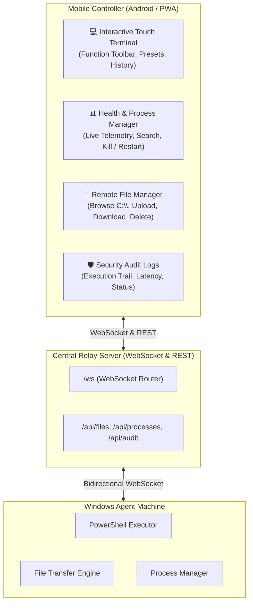

# Mobile Interface (Phase 4)

The **Terminal App Mobile Controller** enables remote administration of Windows agents directly from smartphones and mobile browsers.

---

## 📱 Mobile Architecture & Capabilities



---

## 🌟 Key Mobile Features

### 1. 💻 Mobile Touch Terminal
* **Touch Keyboard Toolbar**: Quick buttons for `Tab`, `|`, `\`, `$`, `-`, `↑`, `↓` that work seamlessly on mobile on-screen touch keyboards.
* **Quick Presets**: 1-Tap execution of common administration commands (`Get-Date`, `Get-Process`, `Get-Service`, `ipconfig`, `systeminfo`).
* **Command History**: Swipe / arrow history retrieval.
* **Syntax Colored Output**: Live stdout and stderr streaming with exit code badges and execution durations.

### 2. 📊 Health & Process Manager
* **Live Telemetry Gauges**: Real-time CPU Load %, RAM Usage MB/%, System Uptime, and Memory gauges updated via background heartbeats.
* **Interactive Process Explorer**: Search, inspect memory utilization (MB) of all active Windows processes.
* **Process Termination**: 1-Tap "Kill" button with confirmation modal to safely terminate frozen remote processes.

### 3. 📁 Remote File Manager & Transfer
* **Directory Navigation**: Breadcrumbs, folder tree exploration across `C:\Users\...` with parent folder navigation (`..`).
* **File Downloading**: Download any remote file directly to your phone/mobile browser with base64 streaming.
* **File Uploading**: Upload files from your phone's photo library or file storage directly into any target directory on the Windows agent.
* **File Deletion**: Remote file removal with safety prompts.

### 4. 🛡️ Security Audit Trail
* **Immutable Activity Log**: Every terminal command executed, file read/write/delete operation, and process termination is recorded with millisecond duration and exit code.
* **Filter & Search**: Audit logs can be filtered by action type (`EXEC_CMD`, `FILE_READ`, `FILE_WRITE`, `FILE_DELETE`, `PROCESS_KILL`).

---

## 🚀 Accessing the Mobile Interface

1. Start the Relay Server on your host or cloud server:
   ```bash
   cd relay
   go run ./cmd/terminal-relay --port 8080 --db ./data/relay.db
   ```
2. On your mobile phone (connected to the same Wi-Fi or cloud host URL), navigate to:
   ```text
   http://<YOUR-IP-OR-DOMAIN>:8080
   ```
3. Use the bottom navigation bar to switch between Terminal, Health, Files, and Audit Logs!
